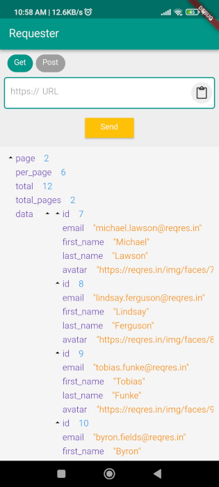

<!-- PROJECT SHIELDS -->
  [](https://github.com/mostafa-efafi/Requester/actions/workflows/build.yml)
   
   [](https://img.shields.io/github/v/tag/mostafa-efafi/Requester?label=latest%20version)
<!-- PROJECT LOGO -->
# Requester

> An application to send all kinds of Http requests and display their answers ,like postman.
  
<p align="left">
    
</p>

_Requester_ is a mobile application written in Flutter to send requests to the server and display their results. No ads, no account, no sign-up, no tracking.

### Features and Components
- Sending all types of requests to the server
- Displaying the return type of JSON in an understandable way
- The possibility of paste an URL
- Written in Dart language and Flutter framework
- Available for Android devices
- The iOS version will be added soon
  
### Install
_Requester_ is available on the [F-droid store](https://f-droid.org/packages/efafi.mostafa.requester) [(Metadata)](https://gitlab.com/fdroid/fdroiddata/-/blob/master/metadata/efafi.mostafa.requester.yml).

[](https://f-droid.org/packages/efafi.mostafa.requester)

Alternatively, download snapshots from the [continuous integration action](https://github.com/mostafa-efafi/Requester/actions/workflows/build.yml) (requires a Github account, be aware that Github zips the apk on download, so unzip first).


### Build
This is a flutter based Android application. Ensure to have Android-Studio (or VSCode) and flutter-sdk installed.
```
flutter pub get
flutter build apk
```
 
### Feature and Contribution Ideas
Pull requests are welcome :heart:.

- [ ] A better logo
- [ ] Method of sending PUT
- [ ] Method of sending DELETE
- [ ] Send header
- [ ] Send token
- [ ] send query

And [more ideas](https://github.com/mostafa-efafi/Requester/issues).

### License
MIT

### About
Built with <3   
by Mostafa Efafi  
https://ir.linkedin.com/in/mostafa-efafi-332b0276?original_referer
